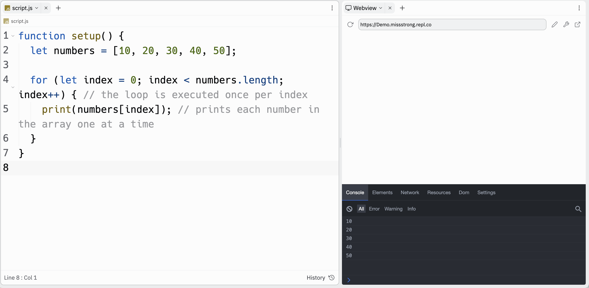
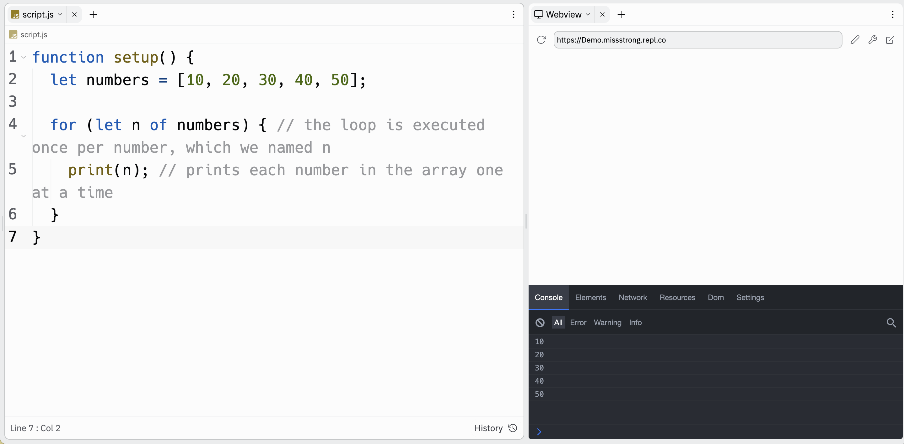
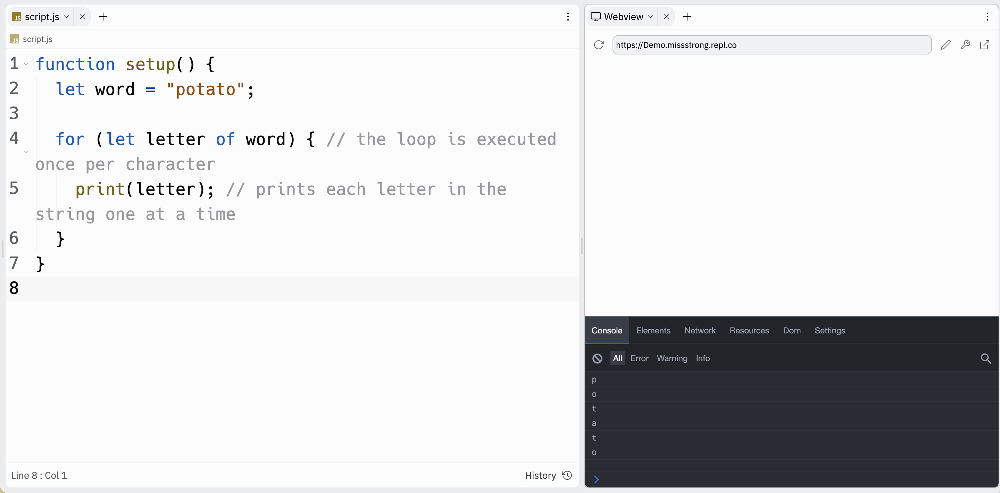

# Link to video.

### Using For Loops with Arrays

We can "go through" each item in an array using a *for* loop by iterating on the indices.

```js
function setup() {
  let numbers = [10, 20, 30, 40, 50]; 

  for (let index = 0; index < numbers.length; index++) { // the loop is executed once per index
    print(numbers[index]); // prints each number in the array one at a time
  }
}
```



This is useful when we need to keep track of the index of each item. Since we didn't use the indices, we could use a different strategy.

### For...Of Loops

We can also use a *for...of* loop to go through arrays.

```js
function setup() {
  let numbers = [10, 20, 30, 40, 50]; 

  for (let n of numbers) { // the loop is executed once per number, which we named n
    print(n); // prints each number in the array one at a time
  }
}
```
This gives the same output as the example above. We can replace `n` with any variable name we want.



*For...of* loops also work on strings. By default it will go through one character at a time.

```js
function setup() {
  let word = "potato";

  for (let letter of word) { // the loop is executed once per character 
    print(letter); // prints each letter in the string one at a time
  }
}
```


