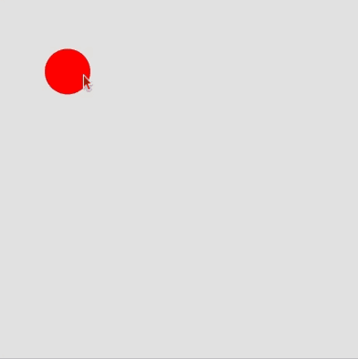

# Link to video.

### Colour Objects

So far we've mostly been using RGB values for colours.

```javascript
function setup() {
    createCanvas(windowWidth, windowHeight);
    background(255, 165, 0); // makes the background orange
}
```


We've also seen built-in strings that represent a variety of [colours recognized by HTML/CSS/Javascript](https://www.w3schools.com/colors/colors_names.asp). 

```js
let colours = ["red", "orange", "yellow", "green", "blue", "indigo", "violet"];

function setup() {
    createCanvas(windowWidth, windowHeight);
    frameRate(10);
    index = 0;
    noStroke();
}

function draw() {
    fill(colours[index]); // this works until we run out of items in the list
    ellipse(mouseX, mouseY, 50);
    index++;
    if (index == colours.length) {
        index = 0; // ensures the index doesn't go out of range
    }
}
```



Another possibility is to use the `color` function, which is built into P5.js. We don't need to make our own colour class since the `color` function creates a `color` object.

```js
function setup() {
  createCanvas(windowWidth, windowHeight);
  let orange = color(255, 165, 0); // orange is a color object
  background(orange); // makes the background orange
}
```

We can get the RGB values of a `color` object using `red()`, `green()`, `blue()` and we can update them using `setRed()`, `setGreen()`, and `setBlue()`.

```js
function setup() {
  createCanvas(windowWidth, windowHeight);

  let mysteryColour = color(random(256), random(256), random(256)); 
  fill(mysteryColour);
  rect(0, 0, width/2, height);
  
  let invertedColour = color(0); // initialize to black
  invertedColour.setRed(255 - red(mysteryColour));
  invertedColour.setGreen(255 - green(mysteryColour));
  invertedColour.setBlue(255 - blue(mysteryColour));
  fill(invertedColour); // the inverted colour will have each RGB inverted from the mystery colour
  rect(width/2, 0, width/2, height);
}
```
The results are different every time the program is run.


