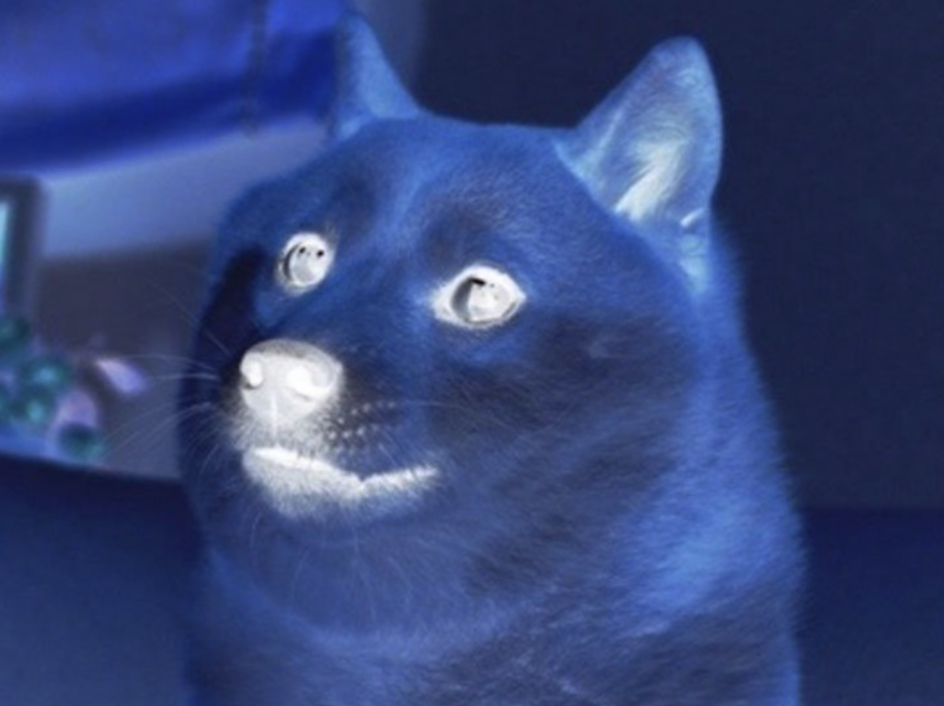

# Link to video.

### Image Methods

We can get update the colours of the individual pixels in an image object using `get()` and `set()`.

The example below gets the colour of the pixel the mouse is on and magnifies it.

```js
let doge;

function preload() {
    doge = loadImage("https://codehs.com/uploads/62d8eab544d31b81511d731d11ef6c00");
}

function setup() {
    createCanvas(windowWidth, windowHeight);
}

function draw() {
    image(doge, 0, 0);
    pixelColour = doge.get(mouseX, mouseY); // gets the colour of the pixel at (mouseX, mouseY)
    fill(pixelColour);
    ellipse(mouseX, mouseY, 50); // this is like a magnifying glass!
}
```


The example below inverts the colours of all the pixels in the image by changing its RGB values to their inverses (255 minus the original number). There are two more image methods here: `loadPixels()` and `updatePixels()`.

```js
let doge;

function preload() {
    doge = loadImage("https://codehs.com/uploads/62d8eab544d31b81511d731d11ef6c00");
}

function setup() {
    createCanvas(400, 400);
    doge.loadPixels(); // we need to call this in order to use .set()
    for (let x = 0; x < doge.width; x++) {
        for (let y = 0; y < doge.height; y++) { // this goes through all the pixels in the image
            pixelColour = doge.get(x, y);
            newPixelColour = color(0, 0, 0); // black is a temporary colour
            newPixelColour.setRed(255 - red(pixelColour));
            newPixelColour.setGreen(255 - green(pixelColour));
            newPixelColour.setBlue(255 - blue(pixelColour));
            doge.set(x, y, newPixelColour); // the new pixel colour is the inverse of what it was before
        }
    }
    doge.updatePixels(); // we need to call this in order for the pixels to update
    image(doge, 0, 0);
}
```


