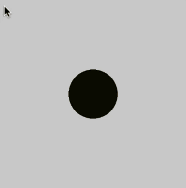
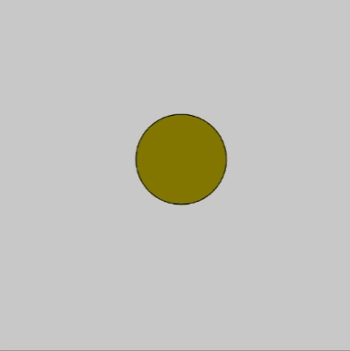

# [Link to video.](https://www.youtube.com/watch?v=2wyNDzsNvwo&list=PLVD25niNi0BkQvmH23k4rixyITzYUwRaS)

### Parameters and Arguments

Some functions require *inputs*. For example, the `rect()` function draws a rectangle, but you have to tell it where on the canvas it goes and what the dimensions are. Some functions do different things depending on the number of arguments and their data types. For example `fill()` can take one number for a monochrome colour, three numbers for an RGB colour, or four number for an RBG colour with some transparency. The names of the inputs are called **parameters** and their values are called **arguments**. 

Some functions provide an *output*, called a **return value**. For example, `random()` outputs a random value for us to use.

### Custom Functions

The program below draws randomly coloured circles.

```js
function setup() {
    createCanvas(400, 400);
    background(200);
}

function draw() {
    let r = 255*mouseX/width;
    let g = 255*mouseY/height;
    let colour = color(r, g, 0);
    
    fill(colour);
    ellipse(width/2, height/2, 100, 100);
}
```



An alternative way of writing this program is to add parameters and a return value to `dynamicColour`.

```js
function setup() {
    createCanvas(400, 400);
    background(200);
}

function draw() {
    let colour = dynamicColour(mouseX, mouseY);
    fill(colour);
    ellipse(width/2, height/2, 100, 100);
}

function dynamicColour(x, y) {
    let r = 255*x/width
    let g = 255*y/height
    return color(r, g, 0);
}
```


One of the advantages of creating a new function is that we can reuse it. For example, we can pass other `(x, y)` values, such as the coordinates of the circle to change the colour.

```js
let circle;

function setup() {
    createCanvas(400, 400);
    background(200);
    frameRate(10);
    
    circle = {
        x: width/2,
        y: height/2,
        diameter: 50
    }
}

function draw() {
    circle.x += random(-10, 10);
    circle.y += random(-10, 10);
    
    colour = dynamicColour(circle.x, circle.y)
    
    fill(colour);
    ellipse(circle.x, circle.y, 100, 100);
}

function dynamicColour(x, y) {
    let r = 255*x/width;
    let g = 255*y/height;
    return color(r, g, 0);
}
```


