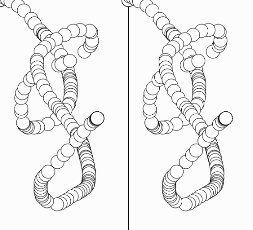
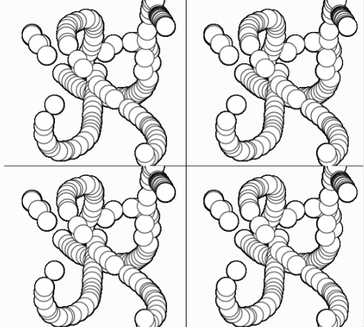
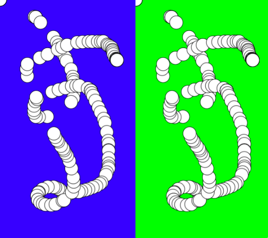
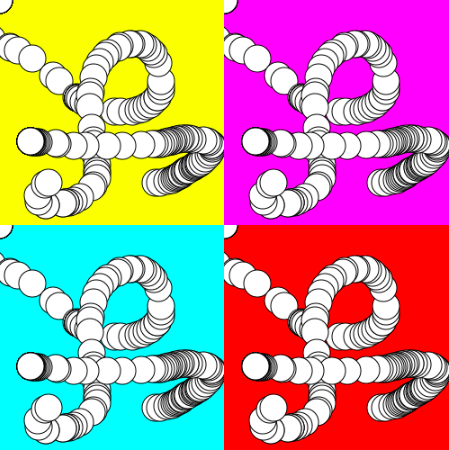

# [Link to video.]()
### Duplicating Graphics 

Suppose we want to create two copies of the same sketch side by side.

One way of doing that is to draw them separately.

```javascript
function setup() {
  createCanvas(windowWidth, windowHeight);
  halfWidth = width/2;
  line(halfWidth, 0, halfWidth, height); // line to separate the left and right half
}

function draw() {
  if (mouseX + 15 < halfWidth) { // the circle has to be entirely in the left half
    ellipse(mouseX, mouseY, 30); // circle in the left half
    ellipse(mouseX + halfWidth, mouseY, 30); // circle in the right half
  }
}
```



Another way is to place both of them on a graphic, and display it twice in different locations. This is a much cleaner approach.

```javascript
function setup() {
  createCanvas(windowWidth, windowHeight);
  halfWidth = width/2;
  
  half = createGraphics(halfWidth, height); // a graphic that takes up half the canvas
  
  line(halfWidth, 0, halfWidth, height); // line to separate the left and right half 
}

function draw() {
  half.ellipse(mouseX, mouseY, 30); // puts the circle onto the graphic (if it's out of bounds it won't draw)
  image(half, 0, 0); // the left half
  image(half, halfWidth, 0); // the rigt half
}
```


We can display as many copies of a graphic as we want.

```javascript
function setup() {
  createCanvas(windowWidth, windowHeight);
  halfWidth = width/2;
  halfHeight = height/2;

  quarter = createGraphics(halfWidth, halfHeight); // a graphic that takes up a quarter of the canvas
  
  line(halfWidth, 0, halfWidth, height); // line to separate the left and right half 
  line(0, halfHeight, width, halfHeight);  // line to separate the top and bottom half 
}

function draw() {
  quarter.ellipse(mouseX, mouseY, 30);  // puts the circle onto the graphic (if it's out of bounds it won't draw)
  image(quarter, 0, 0); // top left quadrant
  image(quarter, halfWidth, 0); // top right quadrant
  image(quarter, 0, halfHeight); // bottom left quadrant
  image(quarter, halfWidth, halfHeight); // bottom right quadrant
}
```



If we want each section to be slightly different, we can make separate graphics.

```javascript
function setup() {
  createCanvas(windowWidth, windowHeight);
  halfWidth = width/2;

  leftHalf = createGraphics(halfWidth, height);
  leftHalf.background(0, 0, 255); // blue background for left half
  
  rightHalf = createGraphics(halfWidth, height);
  rightHalf.background(0, 255, 0); // green background for right half
}

function draw() {
  leftHalf.ellipse(mouseX, mouseY, 30); 
  image(leftHalf, 0, 0);
  
  rightHalf.ellipse(mouseX, mouseY, 30);
  image(rightHalf, halfWidth, 0);
}
```




```javascript
function setup() {
  createCanvas(windowWidth, windowHeight);
  halfWidth = width/2;
  halfHeight = height/2;

  topLeft = createGraphics(halfWidth, halfHeight);
  topLeft.background(255, 255, 0); // yellow background for top left quadrant
  
  topRight = createGraphics(halfWidth, halfHeight);
  topRight.background(255, 0, 255); // magenta background for top right quadrant
  
  bottomLeft = createGraphics(halfWidth, halfHeight);
  bottomLeft.background(0, 255, 255); // teal background for bottom left quadrant
  
  bottomRight = createGraphics(halfWidth, halfHeight);
  bottomRight.background(255, 0, 0); // red background for bottom right quadrant
}

function draw() {
  topLeft.ellipse(mouseX, mouseY, 30);
  image(topLeft, 0, 0);
  
  topRight.ellipse(mouseX, mouseY, 30);
  image(topRight, halfWidth, 0);
  
  bottomLeft.ellipse(mouseX, mouseY, 30);
  image(bottomLeft, 0, halfHeight);
  
  bottomRight.ellipse(mouseX, mouseY, 30);
  image(bottomRight, halfWidth, halfHeight);
}
```



We could modify the example above to a more object-oriented approach by creating an object for each section.

```javascript
function setup() {
  createCanvas(500, 500);
  halfWidth = width/2;
  halfHeight = height/2;

  topLeft = {
    graphic: createGraphics(halfWidth, halfHeight),
    bg: color(255, 255, 0), // yellow background for top left quadrant
    xValue: 0,
    yValue: 0
  }

  topRight = {
    graphic: createGraphics(halfWidth, halfHeight),
    bg: color(255, 0, 255), // magenta background for top right quadrant
    xValue: halfWidth,
    yValue: 0
  }
  
  bottomLeft = {
    graphic: createGraphics(halfWidth, halfHeight),
    bg: color(0, 255, 255), // teal background for bottom left quadrant
    xValue: 0,
    yValue: halfHeight
  }

  bottomRight = {
    graphic: createGraphics(halfWidth, halfHeight),
    bg: color(255, 0, 0), // red background for bottom right quadrant
    xValue: halfWidth,
    yValue: halfHeight
  }

  sections = [topLeft, topRight, bottomLeft, bottomRight];
  
  for (section of sections) {
    section.graphic.background(section.bg); // sets all the background colours
  }
}

function draw() {
  for (section of sections) {
    section.graphic.ellipse(mouseX, mouseY, 30); // puts the circle on all the graphics
    image(section.graphic, section.xValue, section.yValue); // displays all the graphics in the correct location
  }
}
```
