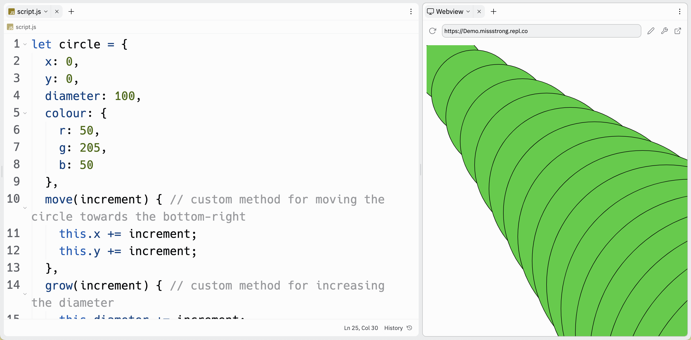

# Link to video.

### Custom Methods

A method is a function that is performed on an object. Methods use dot notation.

We can create our own methods inside of our classes. We write the the name of the method followed by a set of parentheses and a set of curly braces. Inside the parentheses we put any parameters and inside the curly braces we write the body of the method.

class Circle {
    constructor() {
        this.x = 0;
        this.y = 0;
        this.diameter = random(80, 120); 
        this.colour = color(random(255), random(255), random(255));
    }
    move(increment) { // custom method for moving the circle towards the bottom-right
        this.x += increment; 
        this.y += increment; 
    }
    grow(increment) { // custom method for increasing the diameter
        this.diameter += increment;
    }
}

function setup() {
    createCanvas(400, 400);
    background(128);
    circle = new Circle();
    fill(circle.colour);
    frameRate(5);
}
  
function draw() {
    ellipse(circle.x, circle.y, circle.diameter); 
    circle.move(50); // the circle moves 50 pixels right and down
    circle.grow(40); // the circle's diameter grows by 40 pixels
}
```


